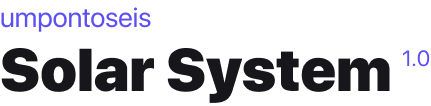

<div align="right" >
   <a href="./README.md">
    </img>
  </a>
</div>
<br/>

<div align="center">
  
</div>

<br/>
<p align="center">
 <a href="#about">About</a>   •
 <a href="#technologies">Technologies</a>   •
 <a href="#how-to-run">How to run</a>   •
 <a href="#license">License</a>   •
 <a href="#author">Author</a>
</p>

<br/>

<p>
  <strong>WARNING:</strong> This project is under contruction.
</p>

<br/>

<a name="about"/>

## :bulb: About the project

<br/>
<div align="center">
  
</div>
<br/>

Welcome to Solar System!

This application is based on @umpontoseis solar sistem design project, created by designers for devs, and you can find it here:

  . [Link to the project on Figma](https://www.figma.com/community/file/871911270417939544/Solar-System---Jonas-Milan) <br/>

  . [Assets avaiable on Google Drive](https://drive.google.com/drive/folders/1thjrYH4W0yjgkG4fM2PL0bCdTw6QhUl_?usp=sharing) <br/>


<br/>
<strong>The project is still under contruction and we'll be building this TOGETHER.</strong>
<br/>


Every week I'll go live on [Twitch](https://www.twitch.tv/whoisiara) and code a part of it, while trying to learn React Native.

<br/>

<div align="center">
  
</div>

<br/>
<a name="technologies"/>

## :rocket: Technologies and Docs

  . [React Native](https://reactnative.dev/) <br/>

  . [React Navigation](https://reactnavigation.org/) <br/>

  . [React Native Gesture Handler](https://docs.swmansion.com/react-native-gesture-handler/index.html) <br/>

  . [React Native SVG](https://github.com/react-native-svg/react-native-svg) <br/>

  . [Babel](https://babeljs.io/) <br/>

  . [Styled Components](https://nodejs.org/en/) <br/>

  . [ESLint](https://eslint.org/), [Prettier](https://prettier.io/) and [EditorConfig](https://editorconfig.org/)<br/>


<br/>
<a name="how-to-run"/>

## :computer: How to run


FIRST OF ALL

. You need to configure your machine to run the application properly. [There is an tutorial](https://react-native.rocketseat.dev/) <br/>

. Also, it's very important to have a package manager, you can use `yarn` or `npm`; <br/>


CLONE THIS REPOSITORY

```sh

$ git clone https://github.com/iaraoliveira/solar-system.git

```

INSTALLING THE DEPENDENCIES

```sh

# run this if you're using yarn
$ yarn

# or this if you're using npm
$ npm install

```

RUN THE APPLICATION

```sh

# start the application
$ yarn start

# then open another instance of your terminal

# verify if you have any devices connected
$ adb devices

# run the app
$ yarn android

```


<br/>
<a name="license"/>

## :notebook_with_decorative_cover: License

This project is under the MIT license, you can read more about it in [LICENSE](./LICENSE.md)


<br/>
<a name="author"/>

<div align='center'>
  <strong>With :white_heart: by iara</strong>
  <br/>
  <a href="https://www.linkedin.com/in/iara/">Let's talk</a>
</div>
